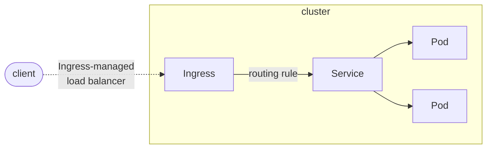

[k8s.ingress](https://kubernetes.io/docs/concepts/services-networking/ingress/)
## Terminology
* Node: A worker machine in Kubernetes, part of a cluster.
* Cluster: A set of Nodes that run containerized applications managed by Kubernetes. For this example, and in most common Kubernetes deployments, nodes in the cluster are not part of the public internet.
* Edge router: A router that enforces the firewall policy for your cluster. This could be a gateway managed by a cloud provider or a physical piece of hardware.
* Cluster network: A set of links, logical or physical, that facilitate communication within a cluster according to the Kubernetes networking model.
* Service: A Kubernetes Service that identifies a set of Pods using label selectors. Unless mentioned otherwise, Services are assumed to have virtual IPs only routable **within the cluster network**.



## ingress controller
Ingress exposes HTTP and HTTPS routes from outside the cluster to services within the cluster. Traffic routing is controlled by rules defined on the Ingress resource.

In order for the Ingress resource to work, the cluster must have an ingress controller running.

An Ingress controller is responsible for fulfilling the Ingress, usually with a load balancer, though it may also configure your edge router or additional frontends to help handle the traffic.

Unlike other types of controllers which run as part of the kube-controller-manager binary, Ingress controllers are not started automatically with a cluster.


## setup the lab

- [x] Setup kuberentes Cluster
- [ ] Install and config haproxy (/etc/haproxy/haproxy.cfg)
- [ ] Setup kubernetes Ingress controller
- [ ] Deploy microservice inside kubernetes cluster
- [ ] Create Ingress resource
- [ ] Use HAProxy to access the deployed microservice withing kubernetes cluster


### Update frontend, backend configuration of haproxy.cfg

```
frontend Local_Server
    bind *:80
    mode http
    default_backend k8s_server

backend k8s_server
    mode http
    balance roundrobin
    server mycloud.leoonline.net 192.168.1.30:8080
```

### Setup kubernetes Ingress controller

* Create a cluster role and cluster role binding for the service account

`
git clone https://github.com/nginxinc/kubernetes-ingress.git --branch v2.2.2
`
ns-and-sa.yaml
rbac.yaml
