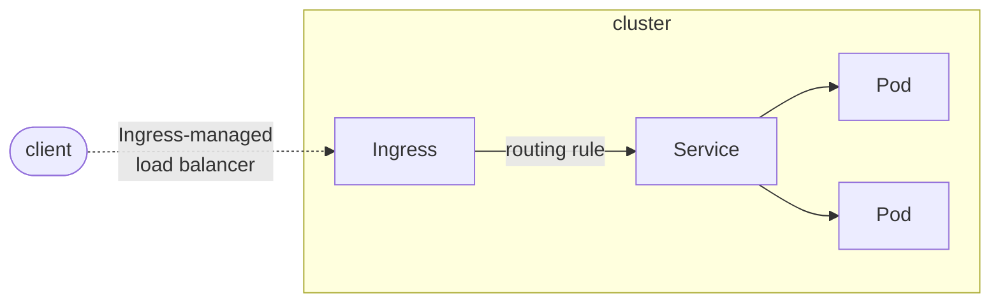

# service
## What is a Service
An abstract way to expose an application running on a set of Pods as a network serice.With Kubernetes you don't need to modify your application to use an unfamiliar service discovery mechanism. Kubernetes gives Pods their own IP addresses and a single DNS name for a set of Pods, and can load-balance across them.

## Defining a Service

```
apiVersion: v1
kind: Service
metadata:
  name: leo-demo-service
spec:
  selector:
    app: leoflaskdemo
  ports:
    - protocol: TCP
      port: 80
      targetPort: 8080
```

This specification creates a new Service object named "leo-demo-service", which targets TCP port 8080 on any Pod with the `app=leoflaskdemo` label.

Kubernetes assigns this Service an IP address (sometimes called the "cluster IP"), which is used by the Service proxies (see Virtual IPs and service proxies below).

> Note: A Service can map any incoming port to a targetPort. By default and for convenience, the targetPort is set to the same value as the port field.


## Virtual IPs and service proxies
Every node in a Kubernetes cluster runs a kube-proxy. kube-proxy is responsible for implementing a form of virtual IP for Services of type other than ExternalName.

### Configuration
Note that the kube-proxy starts up in different modes, which are determined by its configuration.

* The kube-proxy's configuration is done via a ConfigMap, and the ConfigMap for kube-proxy effectively deprecates the behaviour for almost all of the flags for the kube-proxy.
* The ConfigMap for the kube-proxy does not support live reloading of configuration.
* The ConfigMap parameters for the kube-proxy cannot all be validated and verified on startup.

### Choosing your own IP address

### Publishing Services (ServiceTypes)

Kubernetes ServiceTypes allow you to specify what kind of Service you want. The default is ClusterIP.

Type values and their behaviors are:

* ClusterIP: Exposes the Service on a cluster-internal IP. Choosing this value makes the Service only reachable from within the cluster. This is the default ServiceType.
* NodePort: Exposes the Service on each Node's IP at a static port (the NodePort). A ClusterIP Service, to which the NodePort Service routes, is automatically created. You'll be able to contact the NodePort Service, from outside the cluster, by requesting <NodeIP>:<NodePort>.
* LoadBalancer: Exposes the Service externally using a cloud provider's load balancer. NodePort and ClusterIP Services, to which the external load balancer routes, are automatically created.
* ExternalName: Maps the Service to the contents of the externalName field (e.g. foo.bar.example.com), by returning a CNAME record with its value. No proxying of any kind is set up.

# DNS for Services and Pods
Kubernetes creates DNS records for Services and Pods. You can contact Services with consistent DNS names instead of IP addresses.

# Connecting Applications with Services

Kubernetes assumes that pods can communicate with other pods, regardless of which host they land on. Kubernetes gives every pod its own cluster-private IP address, so you do not need to explicitly create links between pods or map container ports to host ports. This means that containers within a Pod can all reach each other's ports on localhost, and all pods in a cluster can see each other without NAT.

## Accessing the Service
Kubernetes supports 2 primary modes of finding a Service - environment variables and DNS. The former works out of the box while the latter requires the CoreDNS cluster addon.

### Environment Variables

```
vagrant@master-1:~$ kubectl exec leo-app-demo-5f65764f75-t5vw6 -- printenv | grep SERVICE
KUBERNETES_SERVICE_HOST=10.96.0.1
KUBERNETES_SERVICE_PORT=443
KUBERNETES_SERVICE_PORT_HTTPS=443
```

### DNS

``` bash
vagrant@master-1:~$ kubectl get services kube-dns --namespace=kube-system
NAME       TYPE        CLUSTER-IP   EXTERNAL-IP   PORT(S)                  AGE
kube-dns   Cl


kubectl run curl --image=radial/busyboxplus:curl -i --tty
If you don't see a command prompt, try pressing enter.
[ root@curl:/ ]$ nslookup leo-demo-service
Server:    10.96.0.10
Address 1: 10.96.0.10 kube-dns.kube-system.svc.cluster.local

Name:      leo-demo-service
Address 1: 10.109.19.22 leo-demo-service.default.svc.cluster.local
[ root@curl:/ ]$ exit

vagrant@master-1:~$ kubectl get service
NAME               TYPE        CLUSTER-IP     EXTERNAL-IP   PORT(S)   AGE
kubernetes         ClusterIP   10.96.0.1      <none>        443/TCP   10h
leo-demo-service   ClusterIP   10.109.19.22   <none>        80/TCP    63m

```

### Securing the Service

### Exposing the Service

# Ingress
[k8s.ingress](https://kubernetes.io/docs/concepts/services-networking/ingress/)
An API object that manages external access to the services in a cluster, typically HTTP.
Ingress may provide load balancing, SSL termination and name-based virtual hosting.


## Terminology
* Node: A worker machine in Kubernetes, part of a cluster.
* Cluster: A set of Nodes that run containerized applications managed by Kubernetes. For this example, and in most common Kubernetes deployments, nodes in the cluster are not part of the public internet.
* Edge router: A router that enforces the firewall policy for your cluster. This could be a gateway managed by a cloud provider or a physical piece of hardware.
* Cluster network: A set of links, logical or physical, that facilitate communication within a cluster according to the Kubernetes networking model.
* Service: A Kubernetes Service that identifies a set of Pods using label selectors. Unless mentioned otherwise, Services are assumed to have virtual IPs only routable **within the cluster network**.



Ingress exposes HTTP and HTTPS routes from outside the cluster to services within the cluster. Traffic routing is controlled by rules defined on the Ingress resource.

## Ingress rules
Each HTTP rule contains the following information:

* An optional host. In this example, no host is specified, so the rule applies to all inbound HTTP traffic through the IP address specified. If a host is provided (for example, foo.bar.com), the rules apply to that host.
* A list of paths (for example, /testpath), each of which has an associated backend defined with a service.name and a service.port.name or service.port.number. Both the host and path must match the content of an incoming request before the load balancer directs traffic to the referenced Service.
* A backend is a combination of Service and port names as described in the Service doc or a custom resource backend by way of a CRD. HTTP (and HTTPS) requests to the Ingress that matches the host and path of the rule are sent to the listed backend.

A defaultBackend is often configured in an Ingress controller to service any requests that do not match a path in the spec.

## Ingress class

Ingresses can be implemented by different controllers, often with different configuration. Each Ingress should specify a class, a reference to an IngressClass resource that contains additional configuration including the name of the controller that should implement the class.


# ingress controller

In order for the Ingress resource to work, the cluster must have an ingress controller running.

An Ingress controller is responsible for fulfilling the Ingress, usually with a load balancer, though it may also configure your edge router or additional frontends to help handle the traffic.

Unlike other types of controllers which run as part of the kube-controller-manager binary, Ingress controllers are not started automatically with a cluster.

```
kubectl apply -f https://raw.githubusercontent.com/kubernetes/ingress-nginx/controller-v1.2.0/deploy/static/provider/baremetal/deploy.yaml

```