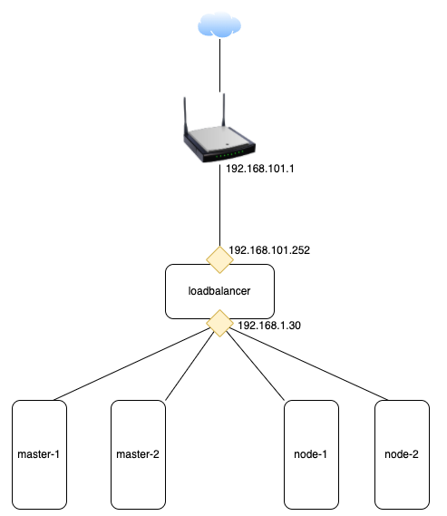

This document is about to create a kubernetes cluster from scatch, this step-by-step instruction will provide a guide to setup your first cluster a local machine using [virtualbox](https://www.virtualbox.org/), it uses [Vagrant](https://www.vagrantup.com/) a fully automated command to bring up a Kubernets cluster.

Ref: [Kelsey Hightower](https://github.com/kelseyhightower/kubernetes-the-hard-way).
ref: [kubernetes-the-hard-way](https://github.com/mmumshad/kubernetes-the-hard-way)

## Prerequirement

Please checkout your hardware and change cpu and ram accordingly in the Vagrantfile, if you are planning to setup more than 3 nodes, please change 'setup-hosts.sh' to update dns settings on all virtual machine.
 `vagrant plugin install vagrant-scp`


## Cluster Details

* kubernetes v1.20.0
* docker
* coredns
* cni
* etcd v3.4.15

* [Kubernetes](https://github.com/kubernetes/kubernetes)
* [Docker Container Runtime](https://github.com/containerd/containerd)
* [CNI Container Networking](https://github.com/containernetworking/cni)
* [Weave Networking](https://www.weave.works/docs/net/latest/kubernetes/kube-addon/)
* [etcd](https://github.com/coreos/etcd)
* [CoreDNS](https://github.com/coredns/coredns)

## Prequeistes
I am running this lab with my laptop which is Macbook Pro 2.6 GHz 6-Core Intel Core i7, for  [VirtualBox](https://www.virtualbox.org) and  [Vagrant](https://www.vagrantup.com/)  on any supported platforms as below should be ok:

- Linux (ubuntu)
- Mac


## Network and IP address

* Masters and Nodes will user `nat` network, which will be auto created by Vagrant, lb will have two NICs, one is connected to `nat`, the other one will bridge to real network to receive internet traffic.



Set's IP addresses in the range

    | VM           | VM Name  |   Purpose    |              IP | Forwarded Port |
    | ------------ | -------- | :----------: | --------------: | -------------: |
    | master-1     | master-1 |    Master    |    192.168.1.11 |           2711 |
    | master-2     | master-2 |    Master    |    192.168.1.12 |           2712 |
    | node-1       | node-1   |     node     |    192.168.1.21 |           2721 |
    | node-2       | node-2   |     node     |    192.168.1.22 |           2722 |
    | loadbalancer | lb       | LoadBalancer |    192.168.1.30 |           2730 |
    |              |          | LoadBalancer | 192.168.101.252 |           2730 |


## Labs
1. Init vms using vagrant
   ``` bash
   # working folder: /data/ssd/500/k8s/vagrant
   vagrant up
   ```

2. Backup vms with snapshots
``` bash
# ../scripts/backup_restore.sh
# init after vagrant up
vagrantBackupStage=Init
for vm in master-1 master-2 node-1 node-2 loadbalancer
  do
    vagrant snapshot save $vm "${vm}-${vagrantBackupStage}"
  done
```

3. setup kubernetes cluster
   ``` bash
   ../scripts/kubeadmin/setupCluster.sh
   ```

4. Check all pods running as expected, then install demo ingress

```
../scripts/ingress.demo.sh
```
## TODO
1. currently the `workstation` is used to init the k8s setup, work need to do to make a to admin k8s. I acutally can use the host machine as the workstation, just copy kube config file to home folder.


## labs to do  [X]
1. currently the `workstation` is used to init the k8s setup, work need to do to make a to admin k8s.


## labs

 kubectl create deployment kubernetes-bootcamp --image=gcr.io/google-samples/kubernetes-bootcamp:v1
